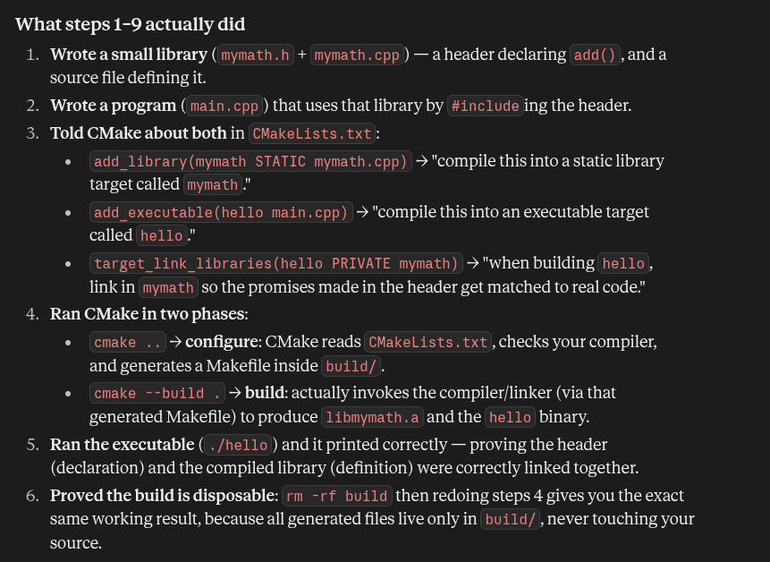
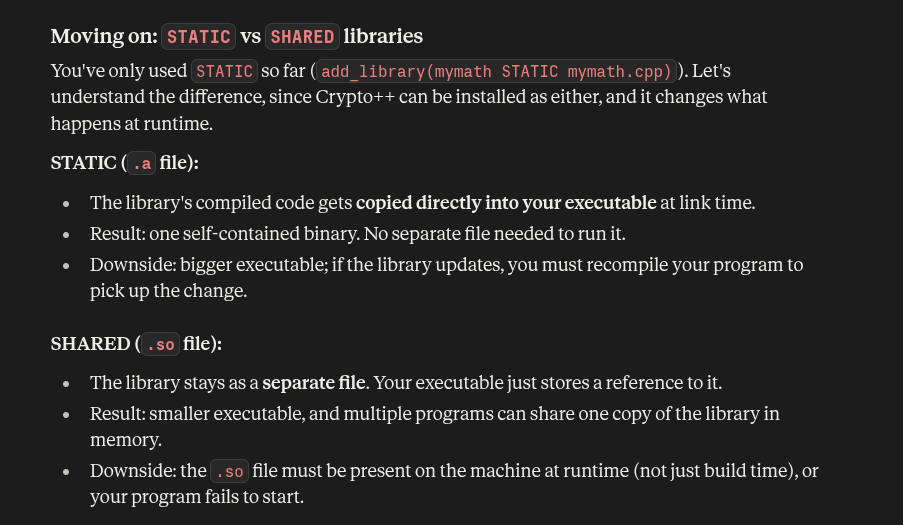

## Cmake prac:



we defined a library (declaration in .h, implementation in .cpp), told CMake to compile it and link it into an executable, and used CMake's two-phase configure/build process to produce and run that executable.

10. included zlib and build exe from cpp with it (cmake supported direct link)

11. included cryptopp/aes.h and build exe from cpp with it (make cmake work by manually finding and linking it)

stared and static lib


12. organised mymathlib ( mymath.h + mymath.cpp + CMakeLists.txt) to be a subdir


build cmd:
```bash
    cd ..
    rm -rf build
    mkdir build && cd build
    cmake ..
    cmake --build .
    ./hello 
```